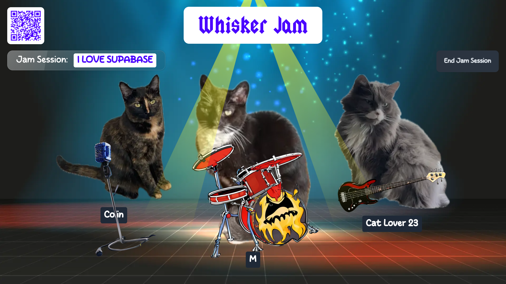
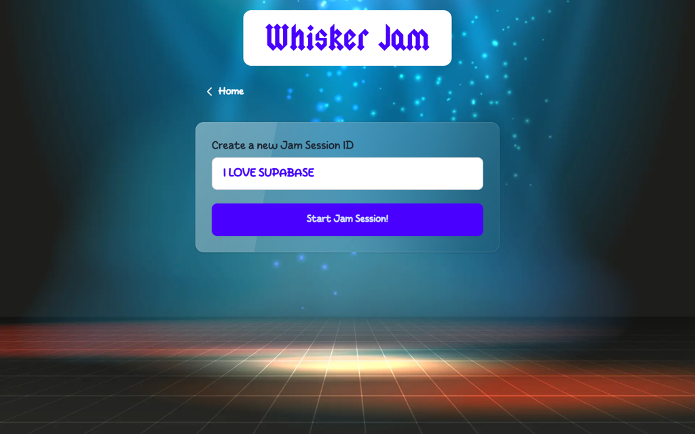

<h1 align="center">Whisker Jam</h1>

<p align="center">The ultimate collaborative cat music experience!</p>

<p align="center">
  
</p>

## About

Using Supabase's realtime capabilities, players from anywhere in the world can choose from a selection of 5 instruments and 5 _real cats_ to create the greatest digital performance the world has ever seen!

### Technology Stack

[](https://angular.dev/)
[](https://supabase.com/)
[](https://www.typescriptlang.org/)

## User Guide

_**Whisker Jam**_ works similarly to Jackbox games: 1 person "hosts" a jam session on a TV, and each player joins the game from their phone.

### 1. Host a Jam Session

Jam sessions are best hosted on a TV or other large device so everyone can see the action.

To host a jam session, log onto [whiskerjam.com](https://whiskerjam.com), click **Host a Jam Session**, type in a custom a jam session ID, and click **Start Jam Session!** 


<p align="center">
  

  


</p>

### 2. Join a Jam Session

Players can join a jam session from their phone or other internet-connected device from anywhere in the world!

The easiest way to join the jam session is to scan the QR code on the hosts's screen. This takes you to the "join" screen with the jam session ID autofilled.

Alternatively, players can log onto [whiskerjam.com](https://whiskerjam.com) and click **Join Jam Session**.

To join the jam session, enter the jam session ID, your nickname, your chosen cat, and your chosen instrument.


<p align="center">
  

  
</p>


### 3. Jam Out!

Once you're in a jam session, it's time to jam out with your band! Tap on your virtual instrument to play music on the host's device.

Drums show a snare, kick, cymbal, and cowbell. All other instruments show a piano keyboard, but don't worry, the sound still matches your chosen instrument!

> [!NOTE]  
> Sound only comes out of the host's device. No sound is played from the players' devices.

<p align="center">
  

  

  
</p>

## Running Locally

### Prerequisites

- [Git](https://git-scm.com/)
- [Node.js](https://nodejs.org/) v20

### Install

```sh
git clone https://github.com/c-o-l-i-n/whisker-jam.git
cd whisker-jam
npm install
```

### Run

```sh
npm start
```

## Author

<a href="https://github.com/c-o-l-i-n">
  
</a>

**Colin A. Williams**

Website: [colinaw.com](https://colinaw.com)
<br>
Github: [@c-o-l-i-n](https://github.com/c-o-l-i-n)
